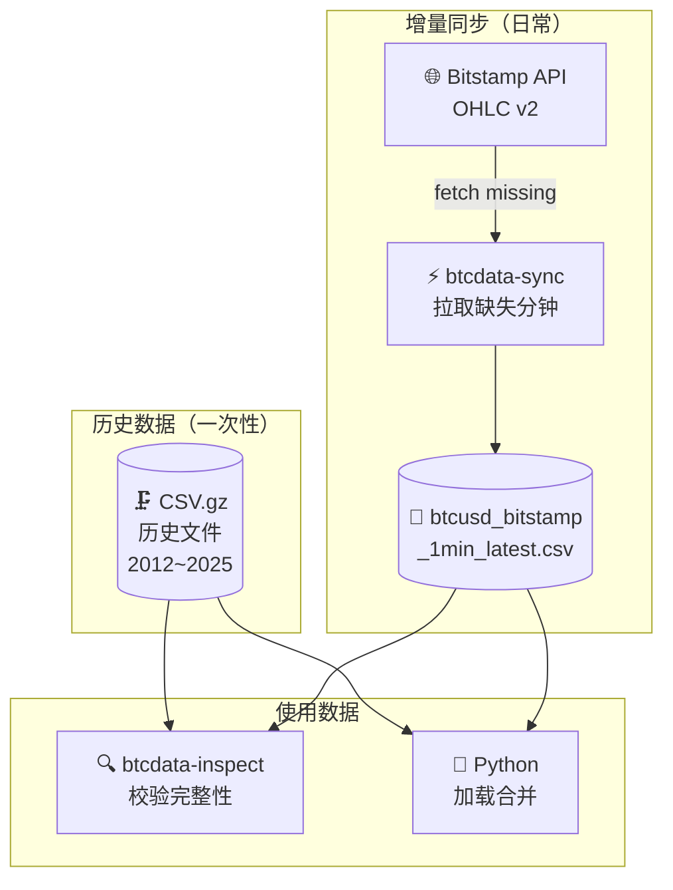

# Bitstamp BTC/USD 1分钟 OHLC 数据

BTC/USD 历史与实时 1 分钟 K 线数据，个人数据基础设施


---

## 📖 项目概述

来自 Bitstamp 交易所的 BTC/USD **1 分钟 OHLC** 数据，覆盖 2012 年至今。历史数据以压缩 CSV 形式存储，增量更新通过 `uv run btcdata-sync` 从 Bitstamp API 拉取。

- 📊 **完整历史** — 2012-01-01 至 2025-01-07，685 万条记录，无缺口无空值
- 🔄 **增量同步** — `uv run btcdata-sync` 从 Bitstamp API 拉取最新分钟数据
- 🔍 **数据校验** — `uv run btcdata-inspect` 检查缺口、重复、空值
- ⚡ **兼容 pandas 3.x** — 修复原版 `fill_missing_minutes` 在 pandas 3 下的时间戳溢出 bug

---

## 📊 数据集概览

| 文件 | 时间范围 | 记录数 | 说明 |
|------|----------|--------|------|
| `data/historical/btcusd_bitstamp_1min_2012-2025.csv.gz` | 2012-01-01 ~ 2025-01-07 | 6,846,600 | 历史压缩包，一次性下载 |
| `data/updates/btcusd_bitstamp_1min_latest.csv` | 2025-01-07 ~ 今日 | ~65万+ | 增量更新文件 |

字段：`timestamp` · `open` · `high` · `low` · `close` · `volume`

---

## 🚀 快速开始

### 环境要求

- [uv](https://github.com/astral-sh/uv) 已安装

### 安装

```bash
git clone https://github.com/ff137/bitstamp-btcusd-minute-data
cd bitstamp-btcusd-minute-data
uv sync
```

### 日常同步

```bash
uv run btcdata-sync
```

输出示例：
```
Loaded daily dataset with 653294 records
No missing minutes detected
No null values detected
Successfully saved 653412 records to data/updates/btcusd_bitstamp_1min_latest.csv
```

### 检查数据

```bash
uv run btcdata-inspect updated   # 检查增量更新文件
uv run btcdata-inspect bulk      # 检查历史压缩包
uv run btcdata-inspect merged    # 检查合并后全量数据
```

---

## 📚 工作流程



---

## 📁 项目结构

```
bitstamp-btcusd-minute-data/
├── data/
│   ├── historical/
│   │   └── btcusd_bitstamp_1min_2012-2025.csv.gz   # 历史数据（需下载解压）
│   └── updates/
│       └── btcusd_bitstamp_1min_latest.csv          # 增量更新（btcdata-sync 写入）
├── scripts/
│   ├── update_data.py       # btcdata-sync 入口
│   ├── inspect_data.py      # btcdata-inspect 入口
│   └── preprocess_bulk_data.py  # 一次性历史数据预处理
├── pyproject.toml
└── uv.lock
```

---

## 🐍 Python 加载示例

```python
import pandas as pd

df_hist = pd.read_csv(
    'data/historical/btcusd_bitstamp_1min_2012-2025.csv.gz',
    compression='gzip'
)
df_recent = pd.read_csv('data/updates/btcusd_bitstamp_1min_latest.csv')

df = pd.concat([df_hist, df_recent], ignore_index=True)
df = df.drop_duplicates(subset='timestamp').sort_values('timestamp').reset_index(drop=True)
print(df.info())
```

---

## 🔗 技术栈

| 库 | 版本 | 用途 |
|----|------|------|
| pandas | >=2.2.3 | 数据处理 |
| requests | >=2.32.3 | Bitstamp API 请求 |
| ruff | >=0.9.7 | 代码格式化（dev） |

---

## 📄 许可证

MIT — Fork 自 [ff137/bitstamp-btcusd-minute-data](https://github.com/ff137/bitstamp-btcusd-minute-data)
